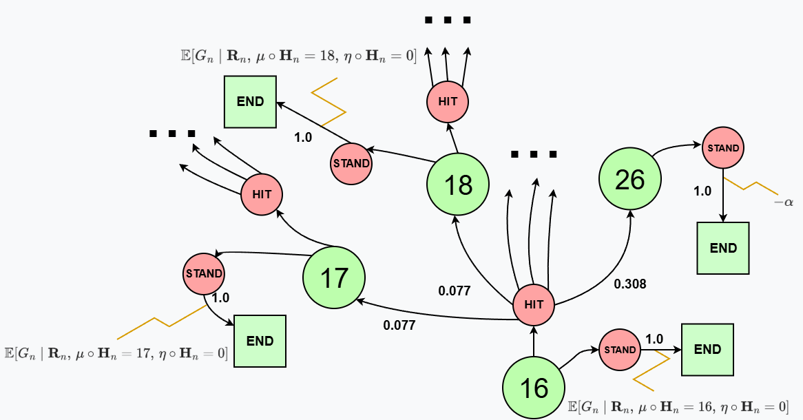
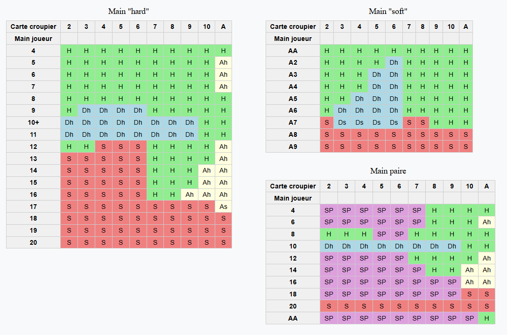
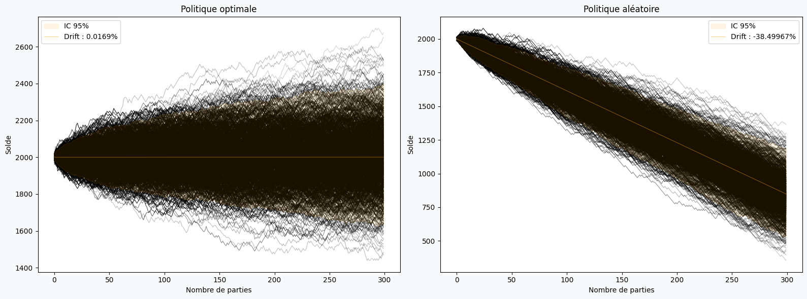
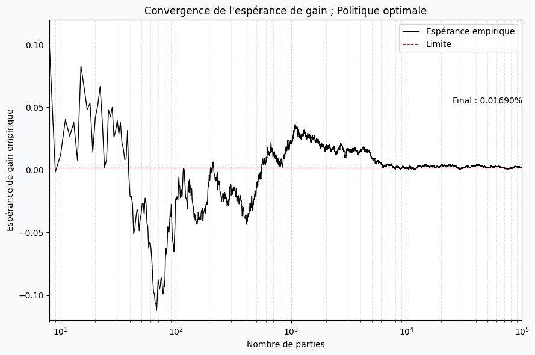
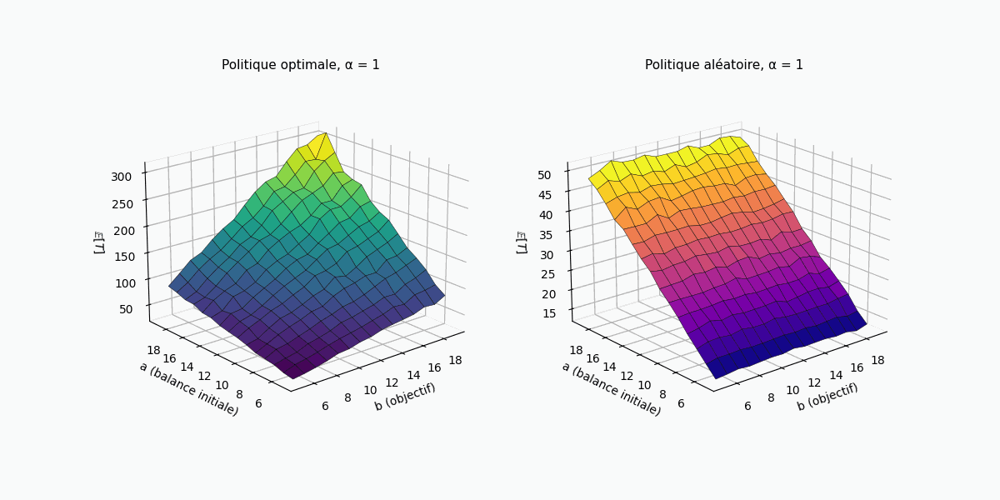
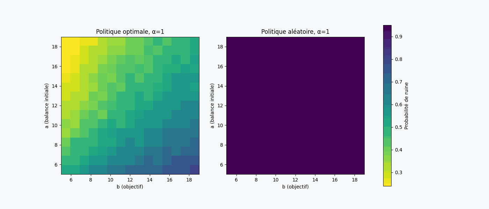

## Abstrait

L’objectif de ce projet est de proposer une modélisation mathématique du Blackjack dans le cadre du contrôle stochastique en temps discret et à espace fini.
Le jeu est formulé comme un processus de décision markovien, dans lequel le joueur doit choisir de manière optimale une stratégie d’arrêt afin de maximiser son espérance de gain.

Une première partie est consacrée à la construction formelle du modèle probabiliste, incluant la définition des variables aléatoires, des transitions d’état et des résultats absorbants du jeu. Les équations d’optimalité de Bellman sont ensuite résolues par programmation dynamique afin de déterminer une politique optimale pour le cas s'un sabot infini puis fini.

Pour les détails de calcul voir BJ.pdf

### Extrait de la résolution du sytème issu d'un Processus de Decision Markovien homogène :

### Choix optimaux pour sabot infini : 

Pour le cas du sabot infini, l'esperance de gain ne dépend seulement des cartes du joueur et celle du croupier. Le choix optimlal est celui qui maximise le gain du joueur compte tenu de ces informations.  

### Simulation de Monte Carlo pour sabot infini : 

Plusieurs calculs d'estimateurs sont effectués pour confronter les résultats théoriques dont l'esperance et variance empirique de gains, la distribution.

### Problème de ruine du joueur : 
 Il peut également être pertinent pour le joueur de s'interroger sur ses probabilités de ruine et de réussite.
Etant donnée une politique $\pi$, une mise constante $\alpha \in \mathbb{R}_+$, un capital de départ $a \in \mathbb{R}_+^*$, et un objectif de gain $b \in \mathbb{R}_+^*$.
Quelle est la probabilité de ruine ou de réussite du joueur ?

    
